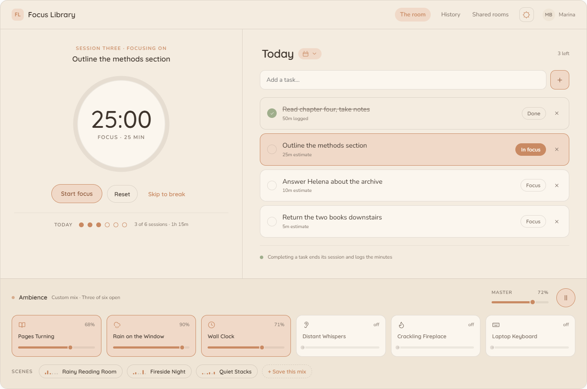
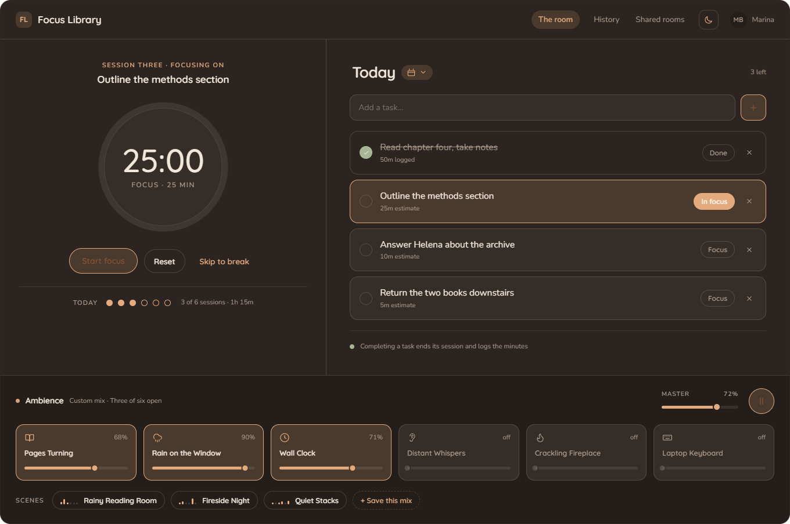
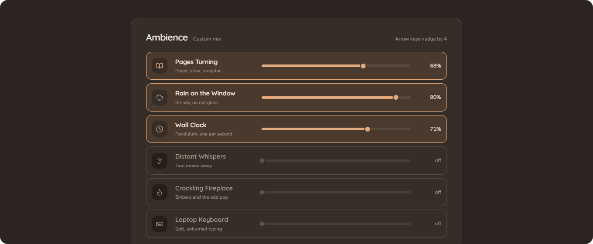
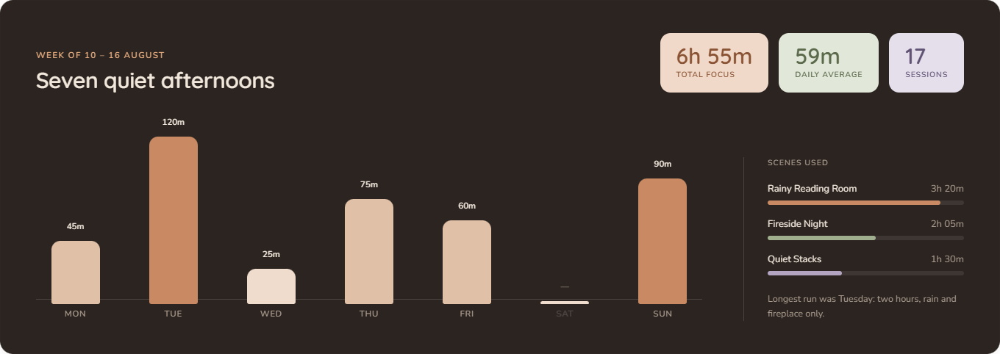
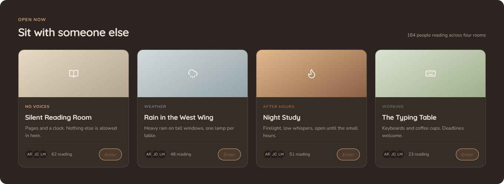

<div align="center">

# 📚 Focus Library

**A cozy virtual reading room for deep work.**

Ambient library sounds, a Pomodoro timer bound to your tasks, and a quiet place to come back to, by day or by firelight.


</div>

> [!NOTE]
> 🚧 **Work in progress.** Focus Library is being built in the open, one ticket at a time.
> The screenshots below are the **final design**; the running app is catching up to them.
> See [Project status](#-project-status) for what already works.



## ✨ What it is

Picture a big armchair in an old library on a rainy afternoon, with a fire going in the next room. Focus Library tries to put that on your screen and help you get through your work.

- 🎧 **Ambient mixer.** Six looping layers: pages turning, rain on the window, a wall clock, distant whispers, a crackling fireplace and a laptop keyboard. Each one has its own volume, and you can save the mixes you like as **scenes**.
- 📝 **Notes for each day.** Your tasks belong to a date. A day picker shows which days have notes.
- ⏱️ **Pomodoro tied to a task.** Pick a task and press *Focus*. When you finish it, the session ends and the minutes are logged.
- 📈 **History.** Seven days of focus time, drawn in the same warm palette, with no neon charts.
- 👥 **Shared rooms** *(planned)*. Join a themed room and see how many people are reading there right now. There are no points, badges or leaderboards.
- 🌗 **Day and night modes.** Both palettes are tuned by hand. The app follows your system setting first, then remembers your choice.
- 🚪 **No sign-up.** Open it and you're already in the room. Your notes and scenes are kept for your browser; optional Google sign-in comes in a later phase.

<table>
  <tr>
    <td></td>
    <td></td>
  </tr>
  <tr>
    <td align="center"><sub>Night mode</sub></td>
    <td align="center"><sub>Ambience mixer</sub></td>
  </tr>
  <tr>
    <td></td>
    <td></td>
  </tr>
  <tr>
    <td align="center"><sub>Focus history</sub></td>
    <td align="center"><sub>Shared rooms</sub></td>
  </tr>
</table>

## 🧱 Tech stack

| Layer | Technology |
|---|---|
| Frontend | React 19, TypeScript, Vite, Material UI with a fully custom theme, TanStack Query, React Router |
| Backend | Python 3.12, FastAPI, SQLAlchemy 2.0 (async), Alembic, Pydantic |
| Data | PostgreSQL 16, Redis 7 |
| Identity | Anonymous browser ID in v1 (no login); Google OAuth2 planned for a later phase |
| Async & realtime *(planned)* | Celery + RabbitMQ for the weekly summary, WebSockets + Redis Pub/Sub for live presence |
| Tooling | Docker Compose, GitHub Actions (lint, tests, image build), Ruff, ESLint, Prettier, Husky |

The architecture, the identity model and the deployment plan are described in
[Documentation/ARCHITECTURE.md](Documentation/ARCHITECTURE.md).

## 🚦 Project status

The project follows a backlog of about 50 tickets in four phases. The detailed plan is in [Documentation/ROADMAP.md](Documentation/ROADMAP.md).

| Phase | Scope | Status |
|---|---|---|
| **0: Foundation** | Monorepo, Docker, FastAPI + Alembic, CI, DB conventions, frontend scaffold, custom theme | ✅ Done |
| **1: MVP** | No login: ambient mixer, notes for each day, day picker, scenes | 🔜 Next up |
| **2: Productivity** | Pomodoro bound to tasks, 7-day history, weekly summary on Telegram | 📋 Planned |
| **3: Shared rooms** | Themed rooms with realtime presence | 📋 Planned |
| **4: Accounts** | Optional Google sign-in, same data on any device | 📋 Planned |

**What you can run today:** the API skeleton (FastAPI, PostgreSQL and Redis in Docker) and the
frontend shell (header, navigation and the custom day/night theme). The product screens come next.

## 🛠️ Running locally

> [!IMPORTANT]
> The app is still under construction, so running it locally only shows the current
> foundation, not the full experience in the screenshots. These steps will change as
> features land.

### Prerequisites

- [Docker Desktop](https://www.docker.com/products/docker-desktop/) (or Docker Engine with the Compose plugin)
- [Node.js](https://nodejs.org/) 24 and npm
- *Optional:* Python 3.12, only if you want to run the API outside Docker

### 1. Clone the repository

```bash
git clone https://github.com/rebecaverasa/Focus_Library.git
cd Focus_Library
```

### 2. Start the backend (API + PostgreSQL + Redis)

```bash
# Create the environment file for Docker Compose (the defaults work for local dev)
cp docker/.env.example docker/.env

# Build and start the containers
docker compose -f docker/docker-compose.yml up -d --build

# Apply the database migrations
docker compose -f docker/docker-compose.yml exec api alembic upgrade head
```

The API runs at **http://localhost:8000**, with interactive docs at **http://localhost:8000/docs**.
To stop everything, run `docker compose -f docker/docker-compose.yml down`.

### 3. Start the frontend

```bash
cd frontend
cp .env.example .env   # points the app to http://localhost:8000
npm install
npm run dev
```

Open **http://localhost:5173**.

### Running the checks

These are the same checks the CI runs on every pull request.

```bash
# Backend: inside backend/, with requirements-dev.txt installed
ruff check .
ruff format --check .
python -m pytest

# Frontend: inside frontend/
npm run lint
npm run build
```

More backend commands (running the API outside Docker, creating migrations, a Windows note about
asyncpg) are in [backend/commands.md](backend/commands.md).

## 📂 Repository layout

```
Focus_Library/
├── backend/          FastAPI app, SQLAlchemy models, Alembic migrations, tests
├── frontend/         React + TypeScript + MUI single-page app
├── docker/           docker-compose for the API, PostgreSQL and Redis
├── Documentation/    design spec, architecture, roadmap, screenshots and the interactive prototype
└── .github/          CI workflow and pull request template
```

## 📖 Documentation

- [DESIGN.md](Documentation/DESIGN.md): palette, typography, the spec for each screen, interactions
- [ARCHITECTURE.md](Documentation/ARCHITECTURE.md): identity and auth, system architecture, stack and DevOps choices
- [ROADMAP.md](Documentation/ROADMAP.md): epics, tickets, dependencies and acceptance criteria
- [Interactive prototype](Documentation/Design/reference/): open `Focus Library.dc.html` in a browser

---

<div align="center">
<sub>Built by <a href="https://github.com/rebecaverasa">Rebeca Veras</a> as a hands-on fullstack project · Name is provisional</sub>
</div>
